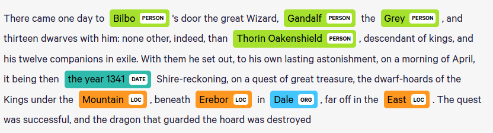

---
output:
  pdf_document: default
---
# Visualização da rede de personagens utilizando o NER

## Objetivo

Nesta atividade, nosso objetivo é utilizar os conhecimentos adquiridos ao longo da disciplina SCC0652 para **gerar um dashboard de visualização interativa** para nosso *corpus* textual utilizando o modelo de Reconhecimento de Entidade Mencionada (NER).

## Conjunto de Dados

Os livros foram retirados do site: https://www.kaggle.com/ashishsinhaiitr/lord-of-the-rings-text. Nosso *corpus*, ou coleção de documentos, consiste em três arquivos `.txt`, cada um contendo um volume da trilogia *The Lord of the Rings*.

Cada um dos documentos pertencente a essa coleção terá seu conteúdo carregado na memória e, na primeira etapa deste projeto, realizamos um pré-processamento, de forma a remover pontuação, stopwords, e lematizar nosso dataset. Esse processo foi ilustrado com o auxílio de wordclouds.


As wordclouds serviram como elemento inicial de análise e deram embasamento para a segunda parte de nosso trabalho. Ao decorrer do processo, notamos que era necessário adotar outros passos em nosso pré-processamento, removendo não só as stopwords, e sim todas as palavras mais comuns da língua inglesa, contribuindo com a acurácia do nosso modelo de Entidade Mencionada.

## O Modelo de Reconhecimento de Entidade Mencionada (NER)


Sem nenhum conhecimento prévio dos romances, o **modelo de reconhecimento de entidade mencionada** (Named-entity recognition ou NER) encontrará os personagens que fazem parte deles. Neste projeto, utilizamos o classificador pré treinado **Spacy NER**. Por conta do alto poder de processamento exigido por este módulo, processaremos as frases uma por vez, ao invés de todo o livro em uma tacada só.



Para cada frase, identificamos as entidades nela mencionadas e fazemos alguns processamentos. Um deles é dividir o nome em palavras únicas, se este for constituído por mais de uma palavra. Assim, "Bilbo" e "Bilbo Baggins" referirão-se a mesma entidade, de forma a contabilizar a ocorrência de um personagem na frase de forma mais apurada.


Após todas as palavras únicas de nome terem sido criadas, filtramos os nomes que aparecem na lista de palavras comuns, pois algumas delas podem vir a ser contadas como entidades equivocadamente. E então, agregamos os nomes de cada frase, e filtramos os nomes cujo número de ocorrência seja menor que um certo limiar definido, a fim de evitar enganos de reconhecimento raros.

### Relevância dos personagens

A partir da lista preliminar de personagens que obtivemos, calculamos a relevância de cada personagem, ou, mais especificamente, a frequência de ocorrência de cada entidade. Fazemos isso com auxílio da função de processamento textual do Scikit-Learn `CountVectorizer`.

Dessa maneira, pudemos selecionar somente os personagens que fossem mais relevantes para nossa análise. Neste trabalho, a função `top_names` retorna os 25 nomes mais mencionados durante a trama.

### Matriz de Co-ocorrência

Neste projeto, tomamos a definição mais simples de co-ocorrência: dois personagens são **co-ocorrentes** se aparecem juntos na mesma frase. É interessante salientar que existem outras definições possíveis, baseadas em parágrafos, número de palavras ou em diversas frases.

Para calcular a co-ocorrência, primeiro é necessário uma **matriz binária de co-ocorrência**, que nos dá a informação de quando um nome ocorre numa dada sentença, novamente com auxílio da função `CountVectorizer`.

Assim, a matrix de co-ocorrência é igual ao produto cruzado entre a matriz de ocorrência e sua transposta. Como a co-ocorrência é mutualmente iterativa, temos que a matriz de co-ocorrência é *triangular simétrica*, conforme ilustrado abaixo.

$$ X_{coocor} = X_{ocor}^T \cdot X_{ocor} $$


## Matriz de Sentimentos

Enquanto a matriz de co-ocorrência dá-nos informações a respeito da **intensidade de interação** entre personagens, a matriz de sentimentos dá-nos informações a respeito da **intimizade sentimental** entre dois personagens. Quanto maior o valor, mais *positiva* é uma relação entre eles (amigos, amantes, etc); quanto menor o valor (podendo ser negativo), mais *negativa* é essa relação (inimigos, rivais, etc) entre os dois.

O processo de cálculo é similar ao da matriz de co-ocorrência, mas precisamos introduzir outros dois conceitos:

#### Score Sentimental do Contexto

O Score de Sentimento do Contexto (Context Sentiment Score) é o score sentimental de cada uma das frases presentes no livro.

Neste projeto, assumimos que o sentimento de relação entre dois personagens é dada por um contexto de co-ocorrência entre eles, sendo o score sentimental atribuído a esse contexto de acordo com a presença de palavras positivas ("love", "smile, "good", etc), neutras ou negativas.

Em nossa implementação, o score sentimental de cada frase é dado pela biblioteca do NLP `Afinn`, e todos os scores são armazenados juntos num array unidimensional, para conveniência da **vetorização**.

#### Taxa de Alinhamento Sentimental

Diferentes autores possuem diferentes estilos descritivos. Por exemplo, uma história de terror provavelmente tem mais descrições de emoções negativas do que um conto de fadas, o que gera distorções em nossa rede de personagens. Em casos extremos, os relacionamentos podem ser todos negativos ou positivos.

A **Taxa de Alinhamento Sentimental** (Sentiment Alignment Rate) é utilizada para alinhar os scores de sentimento de forma a reduzir tais distorções. A estratégia é reajustar o score de sentimento entre dois personagens sempre que uma co-ocorrência for observada.

Essa taxa é calculada a partir do score de sentimento médio de todas as sentenças do livro diferentes de zero, dando-nos um senso intuitivo da distorção do score de sentimento. O sinal negativo ajusta o vetor de sentimentos na direção oposta à da distorção. Como a co-ocorrência não ocorre em todas as frases, o que reduz o efeito do ajuste, nós multiplicamos por 2 para tentar compensar.

Com esses dois conceitos em mente, o cálculo da **matriz de sentimento** pode ser escrito conforme abaixo.

$\theta_{align}$ representa a taxa de alinhamento sentimental,
$V_{sentiment}$ representa o vetor dos scores de sentimento, 
$V^i_{sentiment}$ representa o $i$-ésimo elemento dele, e $N$ seu número de elementos. Além disso, é ainda necessário uma triangulação das matrizes.

$$ \theta_{align} = -2 \times \frac{\sum V_{sentiment}^i} {N_{V_{sentiment}^i}}, V_{sentiment}^i \neq 0$$

$$ X_{sentiment} =  X_{ocor}^T \cdot ( X_{ocor}^T \times V_{sentiment})^T +  X_{coocor} \times \theta_{align} $$


#### Grafos de Co-Ocorrência e de Sentimento

Agora que temos as duas matrizes, podemos transformá-las nos parametros de um grafo e plotá-las. Para isso, primeiro **normalizamos** as matrizes para tornar a magnitude constante entre os diferentes livros, todavia mantendo a diversidade de personagens de um volume.

Em nosso **grafo de sentimento** da trilogia, cada **vértice** representa um personagem do romance e cada **aresta** representa o relacionamento entre ele e algum outro personagem do conjunto. Ainda, o tamanho de cada vértice corresponde a frequência de ocorrência do respectivo personagem.

Em relação a coloração dos arestas, que vai de claro (amarelo) a escuro (roxo), ela representa o **sentimento da relação** entre os dois personagens de forma mais humanamente compreensível: relação *hostil* ou *amigável*. Quanto mais *claro* um arco, mais *amigável* é aquela relação; quanto mais *escura* a cor, mais *hostil* é aquele relacionamento.


## Plot interativo

Como o NER é feito iterativamente sem o uso de paralelização, seu tempo computacional acaba sendo muito custoso. Assim, já pré-carregamos na plataforma os dados processados por ele no arquivo `preliminary_name_list.csv`.

Com as análises prontas, foi criada a parte interativa utilizando as bibliotecas `ipywidgets`, `Plotly` e `voila`. A primeira permitiu criar um menu do tipo "Dropdown" onde o usuário pode selecionar qual livro quer analizar, que podem ser separados ou conjuntos. 

A próxima cria os grafos e permite que sejam interativos, exibindo informações importantes, como por exemplo, quais personagens são mais relevantes, suas interações com as demais entidades (amigável ou hostil) e a quantidade de ocorrências destas interações. 

Para executar a aplicação, digite os comandos no terminal:
```bash
  $ pip install -r requeriments.txt
  $ voila trabalho_viscomp_3.ipynb
```
Por último, o voila permite desenvolver um ambiente interativo, organizado e vizualmente agradável, proporcionando uma interação simples e completa, onde o usuário não precisa se preocupar em compreender a linguagem de programação e estruturas complexas, apenas na realização de sua análise.


## Conclusão

Ao longo deste trabalho, definimos nossos documentos, pré-processamos e, em seguida, procuramos adotar um paradigma visual em nosso conjunto pré-processado de dados. Ao decorrer do processo, notamos que era necessário adotar outros passos em nosso pré-processamento, removendo as palavras mais comuns da língua inglesa para contribuir com a acurácia do nosso modelo de Entidade Mencionada.

Após essa etapa, tínhamos as matrizes de cada uma das análises, e decidimos representá-las como grafos não direcionados, em que cada um dos vértices era um personagem, e as arestas a respectiva análise, de co-ocorrência ou sentimento, das relações em cada um dos livros. Com auxílio do catálogo data-to-viz, decidimos adotar o modelo de representação visual de grafos em rede.

Finalmente, desenvolvemos uma plataforma interativa no `voila` que, com auxílio do `Plotly`, tornou possível uma análise de redes complexas entre personagens que acontece em mais de mil páginas de romance, através de um programa que a gerou tendo como parâmetro de entrada somente os textos dos livros. Isso parecem ser boas notícias para "leitores preguiçosos", que gostam de pular partes da trama sem perder informação relevante do plot.

Gostaríamos de evidenciar que poderíamos ter adotado conjuntamente outros paradigmas de representação, como por exemplo nuvens de palavras, que não foram retomados após a primeira etapa do projeto. Além disso, poderíamos adotar um Modelo de Entidade que abrangesse também apelidos dos personagens (por exemplo, grey e Gandalf, strider e Aragorn são a mesma pessoa), ou o uso de pronomes pessoais. 

Também poderíamos pré-treinar o classificador de alguma maneira, para utilizá-lo especificamente para o universo da narrativa.

## Referências

- Character Network <https://github.com/hzjken/character-network>

- Network Graphs in Python <https://plotly.com/python/network-graphs/>

- Uma Introdução Sucinta à Teoria dos Grafos <https://www.ime.usp.br/~pf/teoriadosgrafos/texto/TeoriaDosGrafos.pdf>

- spaCy Models <https://spacy.io/models>

- Network Diagrams <https://www.data-to-viz.com/#network>

- Python network visualization app using NetworkX, Plotly, Dash <https://github.com/jhwang1992/network-visualization>

-  Matplotlib Colorscales in Python/v3 <https://plotly.com/python/v3/matplotlib-colorscales/>

- Voilà turns Jupyter notebooks into standalone web applications. <https://github.com/voila-dashboards/voila>

  
- Tolkien, J. R. R. (1991). *The lord of the rings* 
 
